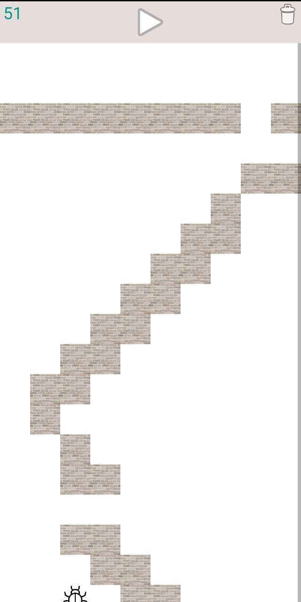

# Beetle Runs

Игра на android. [APK download 1.3 MB](./beetle.apk)

Цель игры - задержать жука в построенном вами лабиринте максимальное время. При этом лабиринт не должен быть замкнут, т.е. должен существовать выход для жучка. Выход находится в правом нижнем углу. Качество лабиринта определяется количеством ходов, которые требуются жуку для того, чтобы выбраться из лабиринта. Жук движется по особому алгоритму, далеко не оптимальному.

Жук всегда начинает свое движение с левого верхнего угла, а выход всегда находится в правом нижнем. Жук движется не оптимально, а следующим образом: он идет туда, где еще не был, либо был там реже. Т.е. проходя каждую клетку лабиринта, жук запоминает: сколько раз он был в этой клетке и при обдумывании направления своего движения в какой то конкретный момент он смотрит: сколько раз он был в клетке снизу, сколько справа, сколько слева и сколько сверху и движется туда, где он был меньше раз. Если таких направлений несколько и одно из них совпадает с текущим направлением движения, то он не меняет направления, иначе он движется согласно следующим приоритетам: вниз, направо, вверх, налево. Т.е. если минимальное число посещений сразу справа и слева (а двигался он при этом вверх или вниз), то жук идет направо, т.к. у "направо" приоритет выше. Следует заметить, что двигаясь по данному алгоритму жук всегда достигнет выхода в том случае, когда выход существует.

